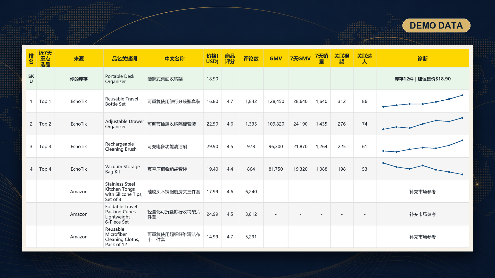

<div align="center">

# Cross-Border E-Commerce Daily Report

**A configurable Codex Skill for verified daily product-intelligence workbooks from EchoTik and Amazon.**


[](LICENSE)

</div>

EchoTik is the bundled default primary platform. Amazon remains the required supplementary source.



*Sanitized demonstration data. No live account, product, or sales records are included.*

## Why this Skill

- Confirms requested product categories through a visible browser workflow.
- Ranks the primary platform's Top 20 products by descending seven-day GMV.
- Adds trends from exactly seven daily sales-amount values when data is available.
- Preserves complete Amazon product titles and complete Chinese translations.
- Generates a controlled XLSX layout with consistent columns, styles, links, and charts.
- Rejects incomplete output and records concise, sanitized failure reasons.

## How it works

**Configure and confirm** → **Collect both sources** → **Rank and enrich the Top 20** → **Verify and export XLSX**

The Skill keeps collection, enrichment, workbook generation, and independent verification behind explicit gates. A report is not considered successful merely because an XLSX file exists.

## Quick start

The verified environment is Windows 10 or 11 with Python 3.12+, Google Chrome, Codex, and authorized access to the configured product sources.

<details>
<summary><strong>Minimal Windows setup</strong></summary>

```powershell
$codexHome = if ($env:CODEX_HOME) { $env:CODEX_HOME } else { Join-Path $HOME ".codex" }
$skillRoot = Join-Path $codexHome "skills/cross-border-ecommerce-daily-report"
git clone https://github.com/huynhledang219-spec/cross-border-ecommerce-daily-report.git $skillRoot
Set-Location $skillRoot
python -m pip install -r ".\scripts\requirements.txt"
python -m playwright install chrome

$runtime = Join-Path $env:LOCALAPPDATA "CrossBorderEcommerceDailyReport"
New-Item -ItemType Directory -Force -Path $runtime | Out-Null
$config = Join-Path $runtime "config.yaml"
Copy-Item ".\scripts\config.example.yaml" $config
notepad $config
python .\scripts\run_report.py --config $config

$output = Read-Host "Generated XLSX path"
python -c "from pathlib import Path; from scripts.ecommerce_report.workbook import verify_report; print(verify_report(Path(r'$output')))"
```

</details>

Chrome opens visibly with an isolated profile. Sign-in remains manual. If CAPTCHA or another human-verification challenge appears, stop and let the user complete it before an explicitly requested retry.

## Configuration and platform support

Copy the example configuration to a local runtime directory and edit only that external copy. Runtime configuration, browser profiles, reports, and failure records must stay outside the repository.

- Categories must be confirmed in the visible platform interface before collection.
- EchoTik is the included default; changing a YAML name does not add platform support.
- Another primary platform requires a tested, registered adapter with equivalent capabilities.
- Amazon remains supplementary market evidence and must represent the same product category.
- Optional daily scheduling is documented with the full configuration workflow.

See [Configuration and platform adapters](references/configuration.md) for category evidence, paths, scheduling, and adapter registration.

## Report guarantees

- Inventory appears first, followed by the configured primary platform and Amazon.
- Top labels remain unique, contiguous, and ordered by descending seven-day GMV.
- At most 20 primary-platform detail pages are opened for the frozen Top 20 identities.
- Valid trends contain exactly seven points; genuine empty trend data is marked without a chart.
- Headers, widths, row styles, hidden helper columns, filters, links, formulas, and chart dimensions are verified before publication.

See [Report schema and verification](references/report-schema.md) for the complete field and workbook contract.

## Safety and limitations

- Keep credentials, cookies, profiles, configurations, generated reports, and failure records out of Git.
- Never place passwords, tokens, executable paths, adapter imports, or remote code in YAML.
- Do not bypass CAPTCHA, login challenges, or human-verification controls.
- Platform interfaces and selectors may change; live-site success is not implied by unit tests.
- EchoTik is the only bundled primary adapter, while Amazon remains the required supplementary source.

Operational rules and failure boundaries are defined in the [Skill instructions](SKILL.md).

## Documentation

- [Skill instructions](SKILL.md) — workflow, authorization gates, and operational safety.
- [Configuration](references/configuration.md) — categories, local paths, scheduling, and platform adapters.
- [Report schema](references/report-schema.md) — normalized fields, workbook layout, and verification.
- [MIT License](LICENSE) — permission to use, modify, and distribute the project.

## Contributing

Keep changes narrow, test-first, privacy-safe, and compatible with the verified Top 20 and seven-day contracts. New platforms must pass the registered adapter capability gate and a user-authorized visible acceptance run.

## License

Released under the [MIT License](LICENSE).
